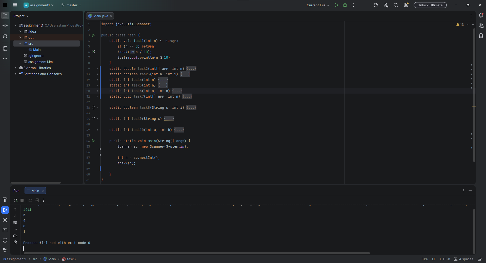
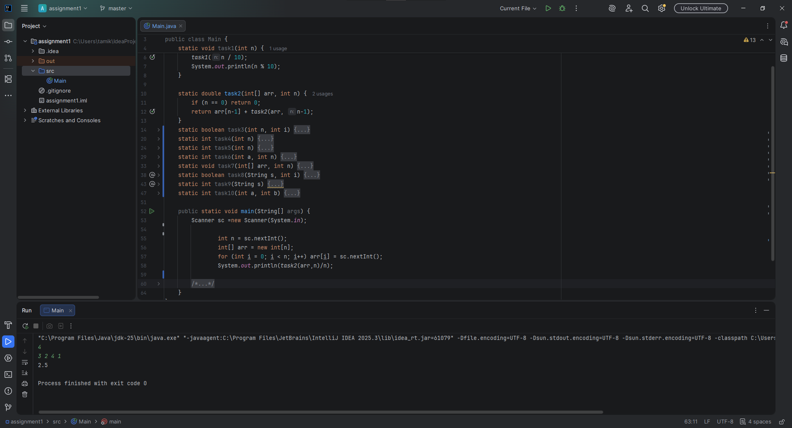
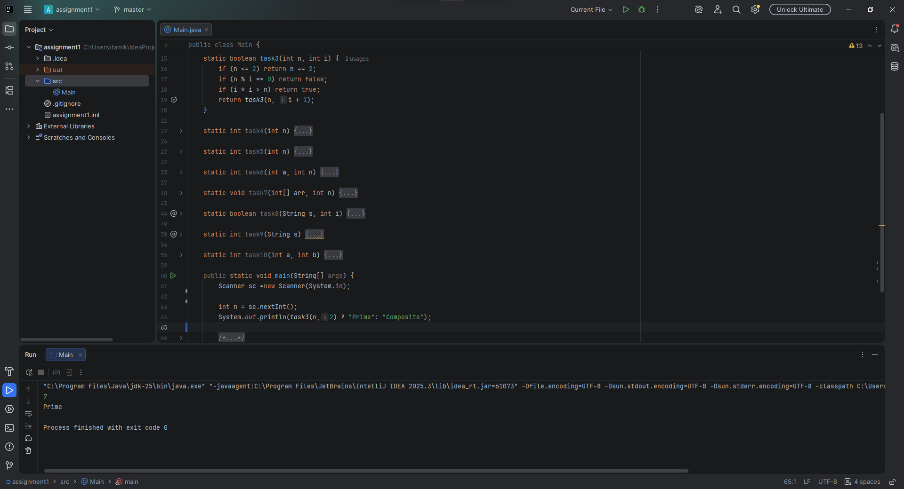
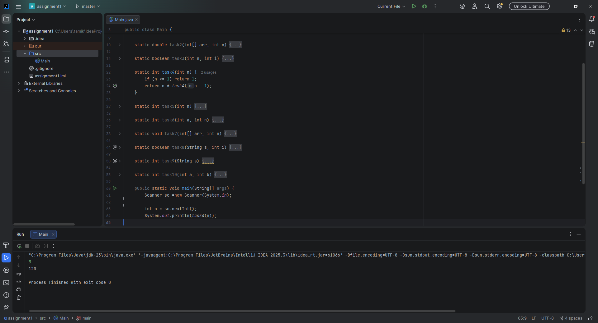
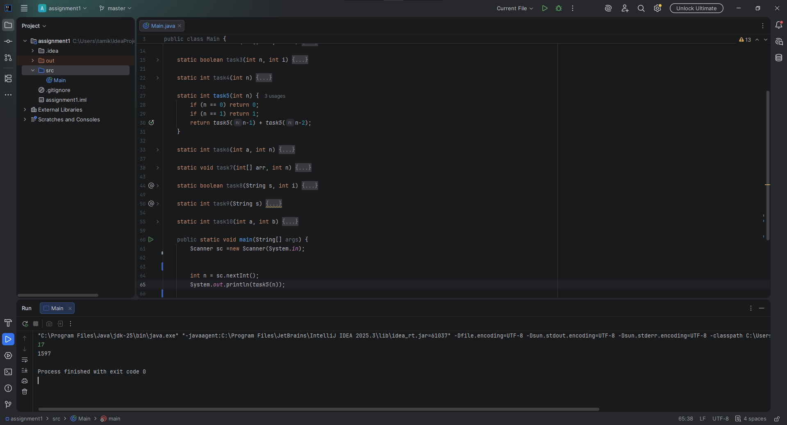
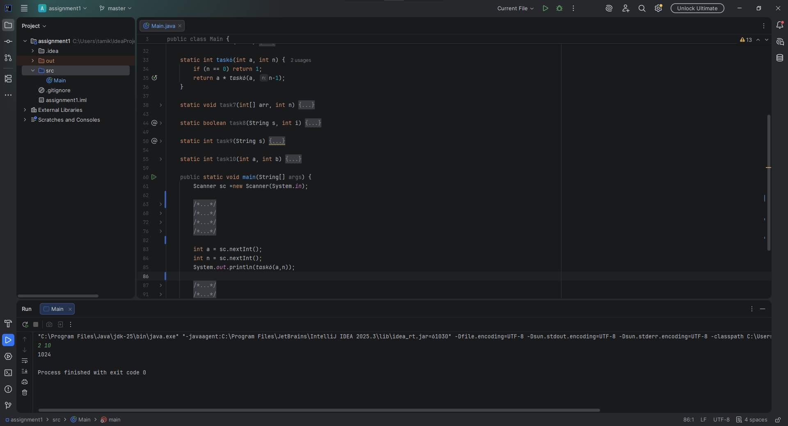
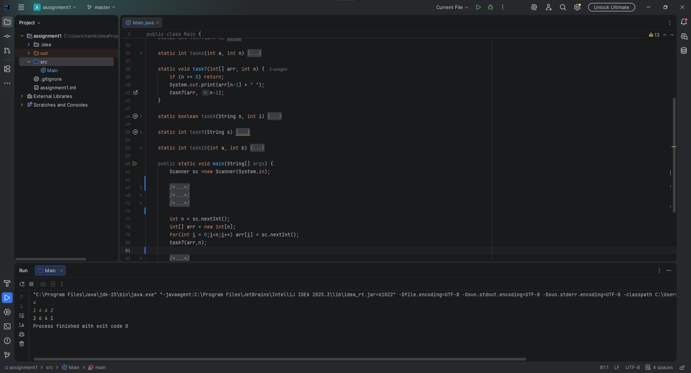
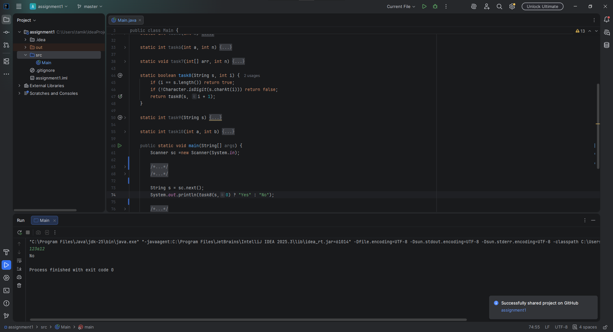
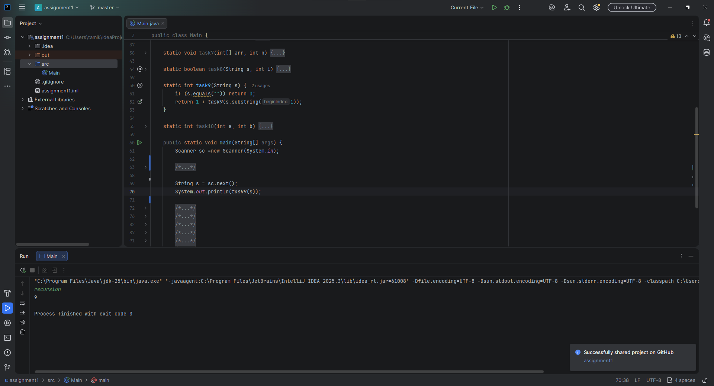
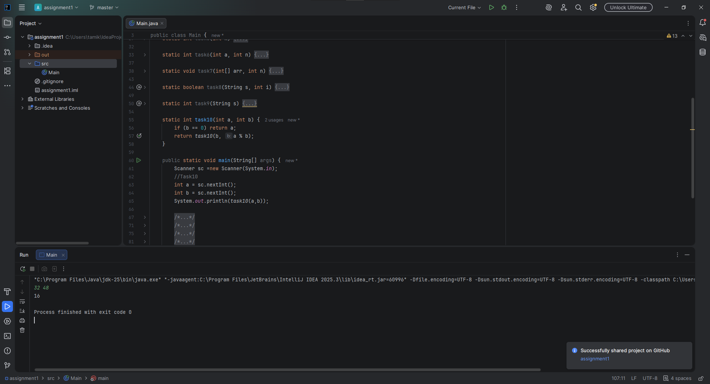

Iskakov Tamerlan
IT-2504

Task 1. Print Digits of a Number
Write a recursive function that takes an integer as input and
prints every digit of the given number on a separate line. 

Task 2. Average of Elements
Write a recursive function to calculate the sum of the
elements, then compute the average using the result.

Task 3. Prime Number Check
Write a recursive function that checks whether a number n is
prime. A prime number is a number that is divisible only by 1 and
itself.

Task 4. Factorial
Write a recursive function that calculates n! (factorial). 

Task 5. Fibonacci Number
Write a recursive function to find the n-th Fibonacci number.

Task 6. Power Function
You are given numbers a and n. Write a recursive function that
returns: a^n

Task 7. Reverse Output
You are given n numbers. Write a recursive function that reads
and prints the numbers in reverse order without using another
array.

Task 8. Check Digits in String
You are given a string s. Write a recursive function that
checks whether the string contains only digits. Return "Yes" if
all characters are digits, otherwise return "No".

Task 9. Count Characters in a String
Write a recursive function that counts the number of characters in a
given string. The function should return the total number of characters
in the string.

Task 10. Greatest Common Divisor (GCD)
Write a recursive function that finds the GCD of two numbers
using the Euclidean Algorithm.

